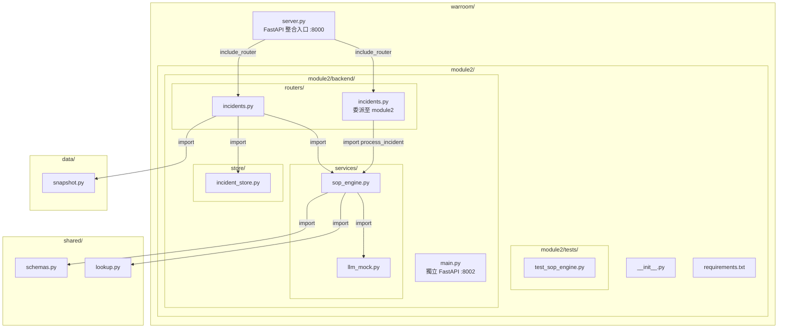

# Design Document: backend-module2-integration

## Overview

本設計將現有 `backend/` 模組（Module 2：即時事件處置與 SOP 規則引擎）遷移至 `warroom/module2/` 目錄下，遵循 `warroom/module5/` 已建立的子模組目錄結構模式。遷移後的 module2 具備雙重啟動模式：獨立開發模式（port 8002）及整合模式（由 `warroom/server.py` 統一掛載）。

**設計目標：**
- 維持與 module5 一致的目錄結構模式
- 確保所有 import 路徑遷移後功能等價
- 保留 `backend/` 舊路徑的向後相容性（過渡期）
- `warroom/routers/incidents.py` 委派至新位置的 SOP 引擎，消除重複邏輯

**關鍵設計決策：**
- 選擇相對 import 作為模組內部引用方式，提高可移植性
- 外部共用層（`shared.*`、`data.*`）保持絕對 import 不變
- 過渡期保留舊 `backend/` 目錄，不做刪除，僅加入棄用註解

## Architecture



### 啟動模式

| 模式 | 指令 | Port | 說明 |
|------|------|------|------|
| 獨立開發 | `uvicorn warroom.module2.backend.main:app --port 8002` | 8002 | 僅 module2 API，用於獨立開發偵錯 |
| 整合運行 | `uvicorn warroom.server:app --port 8000` | 8000 | 所有模組統一入口 |
| 舊路徑（過渡） | `uvicorn backend.main:app --port 8002` | 8002 | 過渡期相容，加棄用警告 |

## Components and Interfaces

### 1. `warroom/module2/backend/main.py` — 獨立 FastAPI 應用

```python
# 介面定義
app: FastAPI  # title="Module 2 — Live Incident Response"

# 端點
GET  /health              → {"status": "ok", "module": "module2-incident-response"}
POST /api/incidents/inject → InjectResponse
GET  /api/incidents/samples → List[Dict]
GET  /api/incidents/active → List[Dict]
POST /api/incidents/{event_id}/resolve → {"status": "resolved", "event_id": str}

# CORS 設定
origins: ["http://localhost:5173", "http://localhost:3000", "http://localhost:8000"]
```

### 2. `warroom/module2/backend/routers/incidents.py` — Router 層

```python
router: APIRouter  # prefix="/api/incidents", tags=["incidents"]

class IncidentIn(BaseModel):
    event_id: str
    type: str
    location: str
    affected_segment: str
    affected_road: str | None = None
    status: str
    severity: str
    description: str
    timestamp: str

class InjectResponse(BaseModel):
    decisions: List[TriggerDecision]
    processing_time_ms: float
    snapshot: Dict[str, Any]
```

### 3. `warroom/module2/backend/services/sop_engine.py` — SOP 規則引擎

```python
def process_incident(incident: dict, snapshot: dict) -> List[TriggerDecision]:
    """主入口：對一筆事件執行 SOP-1/2/5 規則，回傳決策列表。"""

def calculate_ete(incident: dict, primary_seg_id: Optional[str], snapshot: dict) -> dict:
    """SOP-7 ETE 公式計算。"""

def plan_accident_response(incident: dict, snapshot: dict) -> dict:
    """SOP-2 疏散路徑規劃。"""
```

### 4. `warroom/module2/backend/services/llm_mock.py` — LLM 引導文字

```python
def generate_guidance(decision: TriggerDecision) -> Dict[str, str]:
    """呼叫 Ollama 或 fallback mock，回傳 guidance_text + _source。"""
```

### 5. `warroom/module2/backend/store/incident_store.py` — 事件儲存

```python
def inject(incident: dict) -> None
def get_active() -> List[dict]
def resolve(event_id: str) -> bool
def get(event_id: str) -> Optional[dict]
def clear_all() -> None
```

### 6. Import 路徑映射

| 來源（遷移前） | 目標（遷移後） |
|----------------|----------------|
| `backend.routers.incidents` | `warroom.module2.backend.routers.incidents` |
| `backend.services.sop_engine` | `warroom.module2.backend.services.sop_engine` |
| `backend.services.llm_mock` | `warroom.module2.backend.services.llm_mock` |
| `backend.store.incident_store` | `warroom.module2.backend.store.incident_store` |
| `shared.schemas` | `shared.schemas`（不變） |
| `shared.lookup` | `shared.lookup`（不變） |
| `data.snapshot` | `data.snapshot`（不變） |

### 7. `warroom/routers/incidents.py` 委派變更

遷移後此檔案的 SOP 引擎 import 改為：
```python
from warroom.module2.backend.services.sop_engine import process_incident as _engine_process_incident
```

移除任何 `backend.services.sop_engine` 或 `backend.services.llm_mock` 的舊 import。

### 8. `warroom/server.py` 掛載變更

新增 module2 router 的直接掛載（可選，依需求 4 決定是否同時保留 warroom/routers/incidents.py 的掛載）：
```python
from warroom.module2.backend.routers.incidents import router as m2_incidents_router
# 或繼續透過 warroom.routers.incidents（已委派至 module2 引擎）
```

## Data Models

本遷移不引入新的資料模型。所有資料結構沿用 `shared/schemas.py` 中已定義的模型：

- **`TriggerDecision`** — SOP 規則引擎的輸出格式（跨模組共用）
- **`TrafficSnapshot`** — 時間點快照（由 `data/snapshot.py` 產生）
- **`Incident`** — 突發事件結構
- **`RoadSegment`** — 道路路段資料
- **`Station`** — 人流站點資料

Router 層的 Request/Response 模型：
- **`IncidentIn`** — 事件注入請求 schema（Pydantic BaseModel）
- **`InjectResponse`** — 注入回應 schema（含 decisions、processing_time_ms、snapshot）
- **`InjectRequest`** — warroom/routers/incidents.py 使用的注入請求（含預設值）

## Correctness Properties

*A property is a characteristic or behavior that should hold true across all valid executions of a system — essentially, a formal statement about what the system should do. Properties serve as the bridge between human-readable specifications and machine-verifiable correctness guarantees.*

### Property 1: SOP engine always returns well-formed decisions

*For any* valid incident dict (containing required fields: event_id, type, location, affected_segment, status, severity, description, timestamp) and *for any* valid traffic snapshot dict (containing road_segments and stations), `process_incident(incident, snapshot)` SHALL return a non-empty list where each element is a `TriggerDecision` with `triggered` as a boolean, `basis` as a non-empty string, and `entity_id` as a non-null string.

**Validates: Requirements 3.3, 4.3, 5.4**

### Property 2: Response structure invariant across entry points

*For any* valid incident payload that satisfies the `IncidentIn` schema, the JSON response from `/api/incidents/inject` SHALL contain a `decisions` field (list), a `processing_time_ms` field (non-negative number), and a `snapshot` field (dict), regardless of whether accessed through the standalone module2 server (port 8002) or the integrated warroom server (port 8000).

**Validates: Requirements 3.3, 4.3**

### Property 3: ETE formula consistency

*For any* incident with severity in {"Low", "Medium", "High", "Critical"} and *for any* set of affected road segments with saturation scores between 0.0 and 1.0, `calculate_ete()` SHALL return an `ete_minutes` value equal to `base_clearance + max(0, (avg_saturation - 0.5) * 60)` where base_clearance is determined by severity (Critical=60, High=40, Medium=20, Low=10).

**Validates: Requirements 3.3**

### Property 4: Non-triggered incidents produce cascade guidance

*For any* incident that does not match SOP-1, SOP-2, or SOP-5 trigger conditions, `process_incident()` SHALL return exactly one `TriggerDecision` with `triggered=False` and a non-empty `cascade_checks` list containing routing guidance for other modules.

**Validates: Requirements 5.4**

## Error Handling

| 情境 | 行為 | 需求來源 |
|------|------|---------|
| Import 路徑失效 | Python 拋出 `ModuleNotFoundError`，程式啟動失敗 | 需求 2.4、4.5、5.5 |
| 無對應時間點快照 | HTTP 422 + detail 包含最早可用時間戳 | 需求 3.4 |
| IncidentIn schema 驗證失敗 | HTTP 422 + FastAPI 自動產生驗證錯誤訊息 | 需求 3.4 |
| event_id 不存在（resolve 時） | HTTP 404 + detail 包含 event_id | — |
| live_incidents.json 不存在 | HTTP 500 + detail "file not found" | — |
| Ollama 連線失敗 / 逾時 | Fallback 到 mock，`guidance_source="mock"` | — |
| 上下游判定失敗 | 啟用 conservative_mode，所有路口視為上游 | — |

### 過渡期錯誤處理

- 舊路徑 `backend/main.py` 保持完整可用，不拋出額外錯誤
- 遷移完成後，舊路徑頂端加入棄用註解（非 runtime error，僅開發提示）

## Testing Strategy

### 測試分層

| 層次 | 工具 | 目標 |
|------|------|------|
| Smoke tests | `python -c "import ..."` | 驗證目錄結構、import 路徑、package 可辨識 |
| Unit tests (example-based) | pytest | 驗證特定案例（案例 A/B/C）、import 語句檢查、response schema 驗證 |
| Property tests | pytest + hypothesis | 驗證 SOP 引擎的通用屬性（任意有效輸入皆滿足） |
| Integration tests | pytest + httpx (TestClient) | 驗證端點行為、server 啟動、CORS 設定 |

### Property-Based Testing 策略

本功能的核心邏輯（SOP 規則引擎）適合 property-based testing，因為：
- `process_incident()` 是純函式（接受 incident + snapshot，回傳 decisions）
- 輸入空間大（不同 severity、type、segment 組合）
- 存在可驗證的通用屬性（回傳結構不變性、ETE 公式正確性）

**PBT 框架選擇：** [Hypothesis](https://hypothesis.readthedocs.io/) (Python)

**配置：**
- 最低 100 次迭代
- 每個 property test 標記對應設計屬性
- Tag format: **Feature: backend-module2-integration, Property {number}: {property_text}**

**Generator 策略：**
- 隨機生成 `incident` dict：severity 從 {"Low", "Medium", "High", "Critical"} 取樣，type 從已知類型取樣，affected_segment 從 "RD_TPE_001"~"RD_TPE_010" 取樣
- 隨機生成 `snapshot` dict：包含 road_segments（隨機 saturation 0.0~1.0、capacity 500~5000）和 stations

### Unit Tests（Example-based）

沿用原有三個測試案例（遷移至 `warroom/module2/tests/test_sop_engine.py`）：
- **案例 A**：路面塌陷 → SOP-1 + SOP-2，ETE ≈ 83.4
- **案例 B**：號誌故障 → SOP-5，police_needed=6
- **案例 C**：捷運人群推擠 → 非觸發，cascade 含 RD_TPE_001

### Smoke Tests

- `import warroom.module2` 成功
- `warroom/module2/requirements.txt` 可被 pip 解析
- 目錄結構符合 module5 模式

### Integration Tests

- 獨立啟動 → `/health` 回應 200
- 整合啟動 → `/api/incidents/inject` 回應結構正確
- CORS 設定驗證
