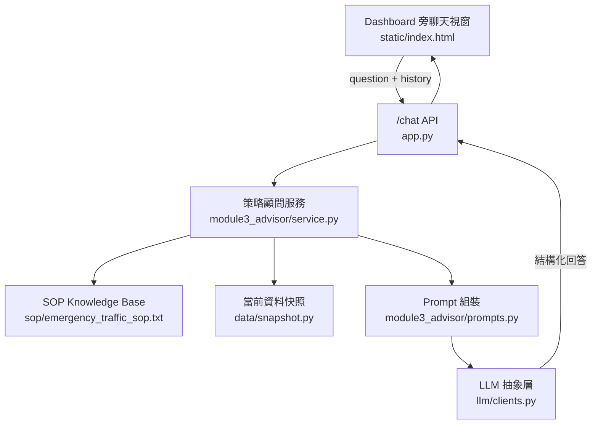

# 模組 3 設計文件：對話式策略諮詢顧問

更新日期：2026.07.17  
版本：v3

模組 3 是 SOP 導向的 what-if 對話顧問，用來回答交通指揮中心的假設性策略問題，例如：

> 若捷運國父紀念館站人潮增至 40,000 人，應觸發哪些法條與動作？

競賽命題要求：

```text
互動式問答介面：Dashboard 旁設有對話視窗，允許指揮官輸入模擬指令或假設性問題。
SOP 邏輯驗證：AI 必須根據輸入的假設條件，立即檢索 SOP 並回答應觸發的法條與預期動作。
此為 LLM 判斷。
```

新版核心任務補充：

| 任務 | 與模組 3 的關係 |
|---|---|
| 應變策略推理 + RAG | 模組 3 透過 SOP Knowledge Base 檢索，把相關條款交給 LLM 判斷；若使用者以文字詢問事故情境，可依第 2 條說明應變策略 |
| 自動化指令產出 | 模組 3 回答會產出指揮官可採用的 CMS / 資訊看板 / 人力派遣建議，但實際派送由其他模組執行 |
| 動態預測與互動問答 | 模組 3 負責 Dashboard 旁 What-if 問答，並在事故與號誌故障情境中引用第 7 條估算預計恢復時間 |
| 多語化通報加分 | 模組 3 可依第 6 條從快照讀取基地台外籍旅客比例，判斷是否需要中英日韓多語通報；真正產生完整多語文案可交由模組 5 |

責任邊界：

- 模組 3 不負責「事件注入」或真正執行路網重規劃，那是模組 2 的職責。
- 模組 3 每次回答都會同時讀取 SOP、使用者假設條件與當前播放時間點的 `TrafficSnapshot`。
- 使用者問題中明講的數字或狀態視為 what-if 假設值，優先覆蓋快照；問題中沒有明講的其他現況，例如替代道路壅塞程度、基地台漫遊率、人流成長率，必須由當前快照提供。

## 使用情境

| 情境 | 使用者問題 | 預期回答重點 |
|---|---|---|
| 捷運分流 | 假設捷運國父紀念館站人潮增至 40,000 人 | 觸發第 3 條；40,000 > 25,000；過站不停、接駁、引導至 BL18 |
| 壅塞判定 | 假設忠孝東路四段已達 A 級壅塞 | 觸發第 1 條 A 級；替代路徑引導、長綠燈時制、警力淨空 |
| 非觸發路段分級 | 假設市民大道四段飽和度達 0.98 | Dashboard 顯示 A 級紅燈；但不觸發第 1 條應變動作 |
| 事故應變詢問 | 假設光復南路發生嚴重車禍並封鎖 | 觸發第 2 條；說明主疏散邏輯、資訊看板內容、連動第 7 條預計恢復時間 |
| 號誌故障 | 假設信義路五段號誌故障 | 觸發第 5 條；每路口 2 名警力、CMS、估計持續時間 |
| 多語通報 | 檢查台北101廣場是否需要啟動多語通報 | 從快照讀外籍旅客比例；達 30% 觸發第 6 條；中英日韓多語簡訊與看板 |
| 條件不足 | 光復南路要不要處置？ | 說明缺少事故類型、嚴重度、封鎖狀態或壅塞等級，不自行引用現況 |

## SOP Knowledge Base / RAG 策略

本模組採用「輕量 KB/RAG」：官方 SOP 條文數量少，為避免向量切 chunk 時漏掉關鍵條款，每次會從 SOP Knowledge Base 取回完整 SOP 作為 LLM 的檢索內容。

```text
使用者假設問題
  -> 檢索 SOP Knowledge Base
  -> 取回 SOP 條文全文
  -> 取得 Dashboard 播放軸時間點的 TrafficSnapshot
  -> 合併「使用者明講假設」與「未明講現況快照」
  -> 注入 system prompt
  -> LLM 根據 SOP 條款做判斷、引用與建議
```

因此它符合「檢索 SOP 後回答」的要求；只是目前資料量小，所以先不用向量資料庫。若未來 SOP 擴充成大量文件，可把 `module3_advisor/sop_loader.py` 換成 embedding / vector search，外層 API 不必改。


## 流程

```text
Dashboard 對話視窗
  -> app.py /chat
  -> module3_advisor.answer_advisory_question()
  -> 檢索 SOP Knowledge Base
  -> 取得當前 TrafficSnapshot
  -> 組 system prompt（SOP + 使用者假設 + 快照）
  -> llm.clients.chat()
  -> JSON response
```



## 檔案對應

| 檔案 | 職責 |
|---|---|
| `static/index.html` | 對話視窗、快捷提問、送出 `/chat` request、保存 history；可用 `?snapshot_timestamp=` 或 `?ts=` 帶入 Dashboard 播放時間點 |
| `app.py` | FastAPI API 入口，提供 `/chat` 與 `/health` |
| `module3_advisor/service.py` | 模組 3 主流程，組合 SOP、history、使用者假設與 LLM 呼叫 |
| `module3_advisor/sop_loader.py` | SOP Knowledge Base 檢索；目前採完整 SOP 取回，日後可替換為向量 RAG |
| `module3_advisor/prompts.py` | 建立 system prompt 與回答規則 |
| `module3_advisor/schemas.py` | 定義 Module 3 回傳資料格式 |
| `data/module3_demo_snapshot.py` | 讀取官方快照；在 `LLM_MODE=mock` 或 `MODULE3_USE_DEMO_SNAPSHOT=true` 時套用 Module 3 demo overlay，不修改官方資料 |
| `data_source/module3_demo_snapshot.json` | Module 3 mock demo 用假快照補充資料；接上真實 Dashboard snapshot 後應關閉或移除這層 overlay |
| `llm/clients.py` | LLM 抽象層，可切換 `mock`、`anthropic`、`bedrock`；Bedrock 模式支援 throttling retry 與 inference profile prefix |
| `sop/emergency_traffic_sop.txt` | 官方 SOP 規則 |

## API 契約

`POST /chat`

Request:

```json
{
  "question": "假設捷運國父紀念館站人潮增至 40,000 人，依 SOP 要啟動哪些捷運與接駁措施？",
  "snapshot_timestamp": "2026-05-20 23:30",
  "history": [
    {"role": "user", "content": "上一輪問題"},
    {"role": "assistant", "content": "上一輪回答"}
  ]
}
```

Response:

```json
{
  "ok": true,
  "answer": "假設捷運國父紀念館站人潮達 40,000 人...",
  "mode": "mock",
  "snapshot_timestamp": "2026-05-20 23:30",
  "sources": [
    {
      "path": "sop/emergency_traffic_sop.txt",
      "score": 1,
      "excerpt": "交通應變標準程序..."
    }
  ]
}
```

## UI 快捷提問設計

自由輸入框放在聊天視窗最下方，評審可直接輸入假設性問題。快捷區只是輔助 demo，不取代自由輸入。

快捷區依 SOP 適用範圍分成兩種：

| 類型 | 設計 |
|---|---|
| 規則查詢 | 第 1 條提供「交通壅塞級別如何判定？」一鍵查詢，說明 A/B 級門檻、Dashboard 顯示與城市應變觸發路段 |
| 固定對象 | 第 1 條只放忠孝東路四段、光復南路；第 3 條固定捷運國父紀念館站；第 4 條固定大巨蛋 |
| 需指定地點 | 第 2 條與第 5 條展開 15 路段中文名稱；第 6 條展開 9 個基地台／站點中文名稱 |

第 7 條 ETE 不是獨立快捷分類，而是在第 2 條事故或第 5 條號誌故障回答中自動附帶。

## 回答格式

每次回答固定三段：

```text
第一行：完整判斷句，不加欄位標籤
■ 建議處置：
■ 後續確認：
```

第一行必須是一句完整決策句，例如：「假設捷運國父紀念館站人潮達 40,000 人，已超過 SOP 門檻 25,000 人，觸發第 3 條（捷運與接駁分流），應立即啟動過站不停與接駁分流。」回答不輸出「判定」或「依據」欄位；SOP 判斷邏輯保留在背後，只呈現指揮官需要採取的結論與動作。

回答文字應以指揮官可直接理解的中文呈現，避免顯示 `BS_`、`RD_`、`User_Count`、`Growth_Rate`、`Saturation_Score` 等內部欄位或 ID。

第 1 條交通壅塞需分成兩層回答：

- 分級顏色：全部 15 路段都適用同一套 A/B 級門檻，用於 Dashboard 紅黃燈顯示。
- 應變動作：只有忠孝東路四段、光復南路屬於城市應變觸發路段；其他路段達 A/B 級時，只顯示顏色，不自動啟動第 1 條長綠燈、警力淨空或替代路徑引導。

若第 2 條事故主疏散路段已壅塞，啟動長綠燈時制的依據是第 2 條但書，不是第 1 條。

## Mock 判斷邏輯細節（`llm/clients.py`）

`LLM_MODE=mock` 不是罐頭字串，而是用規則模擬 SOP 判斷，讓沒有 API key 時也能驗證互動邏輯。以下是幾個容易答錯、因此特別處理過的細節：

### 第 2 條：三態判斷，不能把「沒講」跟「明確否定」混為一談

`status`（封閉／阻斷／限制通行）與 `severity`（嚴重度）都拆成三種狀態，而不是「有 / 沒有」兩種：

| 狀態 | 例子 | 說明 |
|---|---|---|
| 成立 | 「封閉」「嚴重車禍」 | 直接判斷 |
| 明確否定 | 「沒有封閉」「事故嚴重度輕微」 | 使用者已經明講不成立，不可以當成「缺資訊」 |
| 未提及 | 只說「光復南路事故」 | 真的缺資訊，要請使用者補充 |

比對關鍵字時要小心「子字串誤判」：例如「嚴重度」字面上包含「嚴重」兩字，若只做 `in` 比對會被誤判成高嚴重度；「沒有封閉」字面上包含「封閉」，也會被誤判成已封閉。解法是先比對否定詞（沒有／未／並未）與明確用語（輕微），再比對成立關鍵字，且比對前會把已辨識出的路段名稱從文字中移除，避免路名本身帶有干擾字元（例如「松高路」的「高」）誤觸嚴重度判斷。

### 第 3 / 4 條：不可套用固定示範數字

早期版本曾經把「捷運國父紀念館站人潮分流」與「大巨蛋散場」的 mock 回答寫死成固定示範值（人潮 40,000、成長率 -0.25），導致使用者輸入其他數字（例如「目前有 10,000 人」）時仍然回答成「已觸發、40,000 人」。目前改為即時從問題文字抽取使用者實際輸入的人潮數字與成長率，兩個條件分別缺一都會回覆「請補充哪一項」，而不是自行代入示範值。

### 第 6 條：站名比對忽略空白

站名清單使用無空格寫法（例如 `ATT4FUN周邊`），但使用者輸入常會夾雜空格（例如「ATT4FUN 周邊」）。比對前會先移除文字中的空白再比對站名，避免因為多一個空格就答成「資訊不足」。回答輸出時則會在中文與英文字母的交界處自動補回一個空格（例如「顯示 ATT4FUN 周邊外籍旅客比例」），純數字（如「台北101廣場」）不受影響，維持原本寫法。

## 驗收標準

| # | 輸入問題 | 預期輸出 | 驗證重點 |
|---|---|---|---|
| T1 | 假設捷運國父紀念館站人潮增至 40,000 人 | 第 3 條；40,000 > 25,000；過站不停、接駁、引導至捷運市政府站 | 命題方標準題 |
| T2 | 假設忠孝東路四段已達 A 級壅塞 | 第 1 條 A 級；長綠燈、替代路徑、警力淨空 | A 級處置 |
| T3 | 假設光復南路已達 B 級壅塞 | 第 1 條 B 級；長綠燈與警力淨空 | B 級不可答成 A 級 |
| T3-1 | 假設市民大道四段飽和度達 0.98 | Dashboard 顯示 A 級紅燈；不觸發第 1 條應變動作 | 分級顏色與應變觸發不可混淆 |
| T4 | 假設大巨蛋人潮曾達 40,000 人且開始散場 | 第 4 條；連動第 3 條接駁機制 | 連鎖檢查 |
| T5 | 檢查台北101廣場是否需要啟動多語通報 | 從快照讀取外籍旅客比例；若達 30% 則第 6 條成立；簡訊與看板同時多語 | 多語門檻與快照查詢 |
| T6 | 假設某路段壅塞指標只有 0.80 | 不觸發；距 B 級 0.05 | 誠實不觸發 |
| T7 | 連續追問「那如果再加 5,000 人？」 | 能沿用上一輪人數情境 | 多輪 history |
| T8 | 如果光復南路發生嚴重事故並封鎖 | 第 2 條；主疏散邏輯、資訊看板、第 7 條預計恢復時間 | RAG + 事故應變說明 + ETE |
| T9 | 如果信義路五段號誌故障 | 第 5 條；人工指揮、資訊看板、第 7 條預計恢復時間 | 自動化指令建議 |

上表是命題方標準題等級的最小驗收集合。涵蓋 SOP 第 1–6 條「成立 / 明確不成立 / 缺資訊」三種狀態、共約 30 題的完整可勾選清單，見 [`docs/module3_test_checklist.md`](module3_test_checklist.md)，團隊 demo 前建議照該清單跑一遍。

## 與其他模組介接

| 對象 | 協調事項 |
|---|---|
| 模組 1 | Module 3 放在 Dashboard 旁，應接收目前播放時間點，並用該時間點 `TrafficSnapshot` 補足使用者未明講的現況 |
| 模組 2 | 事件注入、live incidents 與路網重規劃由模組 2 負責；Module 3 可讀當前快照與已注入事件作 SOP 問答，但不負責執行重規劃 |
| 模組 4 | 回答格式對齊：條款編號、建議處置、後續確認；推理細節保留在背後，不直接輸出工程欄位 |
| 模組 5 | 第 6 條多語通報門檻一致：任一基地台外籍漫遊旅客比例 ≥ 30%；通報時間格式統一為 `YYYY-MM-DD HH:MM` |
| 全隊 | `LLM_MODE` 可切換 `mock`、`anthropic`、`bedrock`；正式接 AWS 時確認 `BEDROCK_REGION`、`BEDROCK_MODEL_ID`、必要時設定 `BEDROCK_INFERENCE_PREFIX` |

## 風險與備案

| 風險 | 備案 |
|---|---|
| LLM 判斷不穩 | 固定回答格式、低 temperature、用驗收題反覆測 |
| 使用者問題條件不足 | 使用者明講的假設優先；未明講的路況、人流、漫遊率從當前快照補足；若 SOP 所需條件仍不存在才要求補充 |
| Bedrock 尚未開通 | 保留 `mock` 與 `anthropic` 模式 |
| SOP 條文更新 | `sop/emergency_traffic_sop.txt` 獨立維護，prompt 每次全文注入 |
